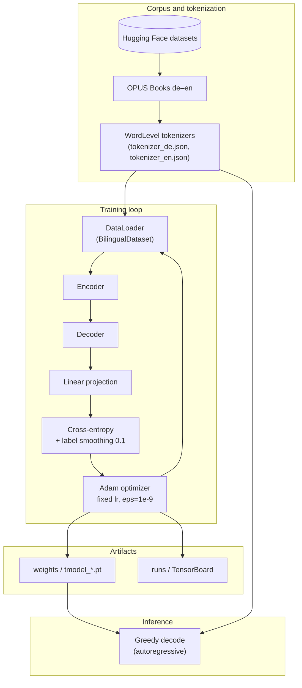
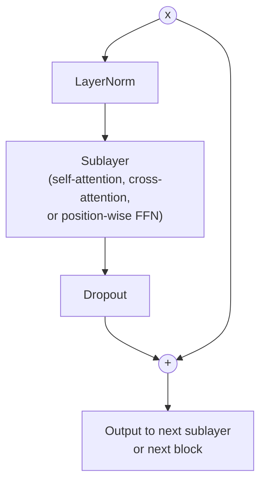

# Transformer-Based Neural Machine Translation from Scratch

A compact research-style codebase that implements an encoder–decoder **Transformer** (Vaswani et al., 2017) for **German–English** translation using **PyTorch**, without high-level sequence APIs beyond standard modules. The implementation is intended for **reproducible experimentation**, **checkpoint portability** (including across Windows and Linux), and **pedagogical clarity**.

---

## Abstract

We present a self-contained neural machine translation (NMT) system built around a multi-head attention Transformer trained on parallel sentences from the **OPUS Books** corpus (`de`–`en`). Source and target sides use **word-level** tokenizers (Hugging Face `tokenizers`). Training optimizes a **masked cross-entropy** objective with **label smoothing**; validation reports **BLEU**, **word error rate (WER)**, and **character error rate (CER)** via `torchmetrics`, with optional **SacreBLEU** in the evaluation notebook. Inference supports **greedy left-to-right decoding**. Repository paths are anchored to the **project root** so scripts, the command-line interface, and Jupyter notebooks agree on locations for weights, tokenizers, and TensorBoard logs regardless of the shell working directory.

---

## 1. Introduction

The dominant architecture for sequence-to-sequence modeling in machine translation is the **Transformer**, which replaces recurrence with **self-attention** and **position-wise feed-forward** layers, enabling efficient parallel training over long contexts. This repository instantiates that paradigm for a **bilingual** setting: encoder states summarize the source sentence; the decoder **attends** to those states while modeling the target distribution autoregressively.

The implementation follows the spirit of Vaswani et al. (2017) while adopting a **pre-norm residual** formulation and **fixed learning-rate Adam** training that match **existing checkpoints** produced from this project (see Section 4 for the precise architectural contract).

**Reference.**

> Vaswani, A., Shazeer, N., Parmar, N., Uszkoreit, J., Jones, L., Gomez, A. N., Kaiser, Ł., & Polosukhin, I. (2017). [Attention Is All You Need](https://arxiv.org/abs/1706.03762). In *Advances in Neural Information Processing Systems* (NeurIPS), 30.

---

## 2. System architecture

### 2.1 High-level data and control flow

The diagram below summarizes how data move from the corpus through tokenization, model optimization, and decoding. Checkpoints and logs are written under paths resolved from the repository root (`nmt/config.py`).



### 2.2 Encoder–decoder Transformer (conceptual)

The model is a stack of **identical encoder blocks** and **identical decoder blocks** (depth `N = 6` by default), with **multi-head attention** (`h = 8`), hidden size **`d_model = 512`**, and feed-forward inner dimension **`d_ff = 2048`**. Positional information is injected via **fixed sinusoidal encodings** added to token embeddings; sublayers use **dropout** (`p = 0.1`).

```mermaid
flowchart TB
  subgraph Source["Source side"]
    xs[Source token IDs] --> emb_s[Embedding × sqrt d_model]
    emb_s --> pe_s[Sinusoidal positional encoding]
    pe_s --> ENCSTACK[Encoder stack N layers]
    ENCSTACK --> mem[Encoder representations\n(keys / values for cross-attention)]
  end

  subgraph Target["Target side (training)"]
    xt[Target token IDs shifted] --> emb_t[Embedding × sqrt d_model]
    emb_t --> pe_t[Sinusoidal positional encoding]
    pe_t --> DECSTACK[Decoder stack N layers]
    mem --> DECSTACK
    DECSTACK --> out[Output hidden states]
    out --> linear[Linear d_model → |V_tgt|]
    linear --> loss[Softmax / loss vs labels]
  end
```

### 2.3 Residual block (pre-norm variant used in this repository)

Each encoder (respectively decoder) **sublayer** applies **layer normalization before** the sublayer, then a **residual add** with **dropout** on the sublayer output. After `N` blocks, an additional **layer normalization** is applied at the top of the encoder and decoder stacks. This **pre-norm** pattern differs from the original post-norm diagram in Vaswani et al. (2017) but is common in tutorials and matches **checkpoints trained from this codebase**.



---

## 3. Repository layout

| Path | Description |
|------|-------------|
| `nmt/` | Installable package: configuration, `model`, `dataset`, `train`, `translate`, checkpoint I/O |
| `train.py`, `translate.py` | Root entry points; equivalent to `python -m nmt.train` and `python -m nmt.translate` |
| `notebooks/` | `inference.ipynb`, `evaluate_model.ipynb`, `attention_visual.ipynb` |
| `weights/` | Serialized training state (`tmodel_XX.pt`) |
| `tokenizer_{de,en}.json` | Fitted word-level tokenizers (created on first training run) |
| `runs/` | TensorBoard event files |
| `pyproject.toml` | Editable install metadata (`pip install -e .`) |
| `requirements.txt` | Runtime dependencies (PyTorch, `datasets`, `tokenizers`, metrics, TensorBoard, etc.) |

---

## 4. Architectural and training contract (checkpoint compatibility)

The following choices define the **computational graph** assumed by weights produced from this repository:

- **Residuals:** pre-norm, `x + Dropout(Sublayer(LayerNorm(x)))` within each sublayer; **final layer norm** after the full encoder and decoder stacks.
- **Embeddings and logits:** **no weight tying** between target embeddings and the output projection.
- **Optimization:** **Adam** with fixed learning rate `lr` (default `10^{-4}`), `eps = 10^{-9}`, and **label smoothing** `0.1` on the target vocabulary.
- **Positional encoding:** sinusoidal, non-learned; same scheme on source and target.

Hyperparameters (`batch_size`, `seq_len`, `num_epochs`, language pair, `datasource`) are centralized in `nmt/config.py`. The default data source is **`opus_books`** for the configured language pair.

---

## 5. Installation and environment

From the repository root:

```bash
python -m venv .venv
.\.venv\Scripts\Activate.ps1
python -m pip install --upgrade pip
pip install -r requirements.txt
pip install -e .
```

On Windows, if script activation fails, install with the venv interpreter explicitly:

```powershell
.\.venv\Scripts\python.exe -m pip install -r requirements.txt
.\.venv\Scripts\python.exe -m pip install -e .
```

**TensorBoard** is listed in `requirements.txt` and is imported **only inside** `train_model()` so that importing `get_model`, `get_dataset`, or `greedy_decode` in notebooks does not require TensorBoard unless training is executed.

**Cross-platform paths:** artifact paths are built from the repository root (`get_project_root()` in `nmt/config.py`), which stabilizes behavior under Windows and Linux regardless of the process current working directory.

---

## 6. Usage (reproducibility)

**Training**

```bash
python train.py
```

**Resuming** from an epoch checkpoint: set `"preload": "<epoch>"` in `nmt/config.py` (e.g. `"09"` for `weights/tmodel_09.pt`).

**TensorBoard**

```bash
tensorboard --logdir runs
```

(run from the repository root, or after the notebooks’ `os.chdir` to the root).

**CLI translation**

```bash
python translate.py "Ich bin ein Berliner."
```

Default inference epoch is `checkpoint_epoch` in `nmt/config.py` (e.g. `"31"`).

**Notebooks** under `notebooks/` bootstrap `sys.path` and `chdir` to the project root so relative paths to `weights/` and `runs/` remain valid when the kernel’s working directory is not the repository root.

---

## 7. Evaluation protocol (sketch)

- **Validation during training:** a small number of greedy-decoded examples are printed; **CER**, **WER**, and **torchmetrics BLEU** are logged when a `SummaryWriter` is present.
- **Offline evaluation:** `notebooks/evaluate_model.ipynb` supports **SacreBLEU** and metric aggregation over many validation batches.
- **Attention visualization:** `notebooks/attention_visual.ipynb` renders **Altair** heatmaps of encoder self-attention, decoder self-attention, and encoder–decoder cross-attention for selected layers and heads (attention tensors are read from the last forward pass that populated each module).

---

## 8. Empirical note (illustrative)

On German–English OPUS-style training with this stack, validation **BLEU** in the low-to-mid 50s, **WER** near **0.67**, and **CER** near **0.33** have been reported for strong checkpoints; exact numbers depend on epoch, hardware, and data filtering. Treat any single run as **indicative**, not a benchmark claim.

---

## 9. Citation

If you use this repository or build on its code, please cite the original Transformer paper and, if appropriate, acknowledge this codebase:

```bibtex
@inproceedings{vaswani2017attention,
  title     = {Attention is All You Need},
  author    = {Vaswani, Ashish and Shazeer, Noam and Parmar, Niki and Uszkoreit, Jakob and Jones, Llion and Gomez, Aidan N and Kaiser, Lukasz and Polosukhin, Illia},
  booktitle = {Advances in Neural Information Processing Systems},
  volume    = {30},
  year      = {2017}
}
```

---

## License and disclaimer

Training consumes network bandwidth (dataset download) and compute (GPU recommended). Model quality and metric estimates are **not warranted**; use at your own discretion for research and education.
