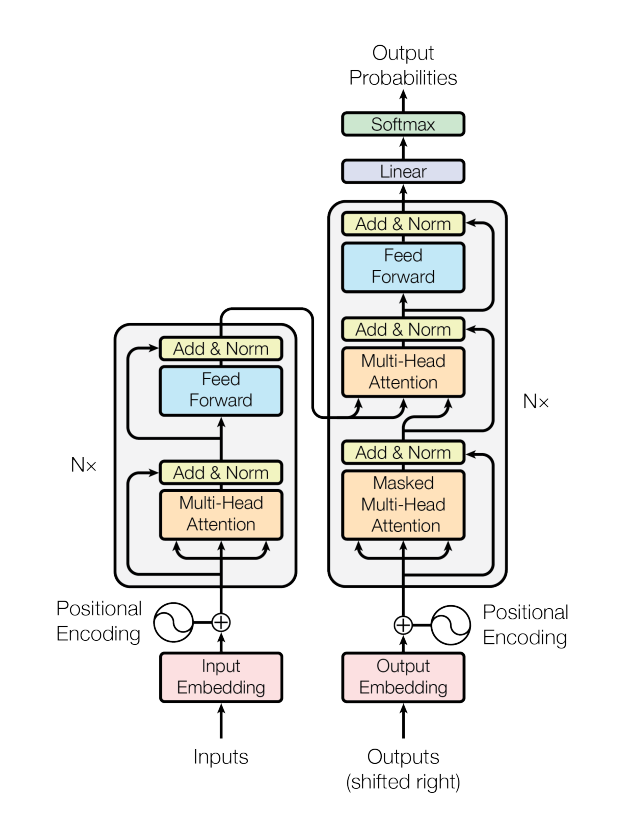

# Transformer Translation from Scratch

**German → English** neural machine translation with a **Transformer** encoder–decoder implemented in **PyTorch** without the built-in `nn.Transformer` stack (attention, FFN, masks, and training loop are explicit). The reference is [**Attention Is All You Need**](https://arxiv.org/abs/1706.03762) (Vaswani et al., NeurIPS 2017).

Code lives in the **`nmt`** package (`pip install -e .`). Weights, tokenizers, and TensorBoard paths use **`get_project_root()`** in `nmt/config.py`, so the CLI and notebooks behave the same on **Windows and Linux** no matter which directory you launch Python from.

---

## Compared to Vaswani et al. (2017)

| Topic | This repository | Paper (typical) |
|--------|-----------------|-----------------|
| Residual layout | **Pre-norm** + final stack norm | **Post-norm** (“Add & Norm” in Figure 1) |
| Optimizer schedule | **Adam**, fixed `lr = 10^{-4}`, default `β₂` | **Noam** warmup schedule, `β₂ = 0.98` |
| Embeddings vs logits | **Separate** target embedding and output linear | **Weight tying** (Sec. 3.4) |
| Data & tokens | **OPUS Books** `de`–`en`, **word-level** tokenizers | WMT’14-style **BPE** benchmark setup |
| Decoding at inference | **Greedy** | **Beam** (e.g. width 4) in reported BLEU tables |

Everything else is aligned in spirit with the **base** model: scaled dot-product multi-head attention, sinusoidal positional encoding, ReLU FFN, dropout **0.1**, label smoothing **0.1**. The table above is what defines **checkpoint compatibility** for this repo.

---

## What is included

| Piece | What you get |
|-------|----------------|
| **Defaults** | **N = 6** layers, **h = 8** heads, **d_model = 512**, **d_ff = 2048**, dropout **0.1**, label smoothing **0.1** |
| **Training** | `train.py` / `nmt/train.py` — masked CE + label smoothing, Adam, TensorBoard, `weights/tmodel_XX.pt` per epoch; checkpoints reloaded with `map_location` via `nmt/checkpoint.py` |
| **Inference** | `translate.py` — greedy decoding; epoch from `checkpoint_epoch` in `nmt/config.py` |
| **Resume** | `"preload": "<epoch>"` in `nmt/config.py` matching `weights/tmodel_<epoch>.pt` |
| **Notebooks** | `inference.ipynb`, `evaluate_model.ipynb` (SacreBLEU + WER/CER), `attention_visual.ipynb` (Altair maps) — first cell sets repo root on `sys.path` and `chdir` |
| **Config** | `nmt/config.py` — batch size, `seq_len`, languages, `datasource` (default `opus_books`), `checkpoint_epoch`, etc. |

---

## Architecture (paper figure)

Figure 1 from the paper (encoder left, decoder right, **N**× blocks, then linear + softmax):



---

## Repository paths

| Path | Role |
|------|------|
| `nmt/` | `config`, `model`, `dataset`, `train`, `translate`, `checkpoint` |
| `train.py`, `translate.py` | Same as `python -m nmt.train` / `python -m nmt.translate` |
| `notebooks/` | Inference, evaluation, attention |
| `weights/` | `tmodel_*.pt` |
| `tokenizer_de.json`, `tokenizer_en.json` | Created on first train |
| `runs/` | TensorBoard |
| `requirements.txt`, `pyproject.toml` | Dependencies and editable install |

---

## Installation

```bash
python -m venv .venv
.\.venv\Scripts\Activate.ps1          # Windows PowerShell
python -m pip install --upgrade pip
pip install -r requirements.txt
pip install -e .
```

If activation fails: `.\.venv\Scripts\python.exe -m pip install -r requirements.txt` and `.\.venv\Scripts\python.exe -m pip install -e .`.

The `tensorboard` package is in `requirements.txt` (needed for training and `%tensorboard` in notebooks). `SummaryWriter` is imported **only inside** `train_model()`, so importing helpers from `nmt.train` in notebooks does not require TensorBoard until you actually run training.

---

## How to run

| Goal | Action |
|------|--------|
| Train | `python train.py` |
| TensorBoard | `tensorboard --logdir runs` (from repo root) |
| Translate | `python translate.py "German sentence here."` |
| Change inference epoch | `checkpoint_epoch` in `nmt/config.py` |
| Resume training | `preload` in `nmt/config.py` → matching `weights/tmodel_*.pt` |

---

## Evaluation and results

**Training** (`nmt/train.py`): prints a few validation examples each epoch; logs **CER**, **WER**, and **torchmetrics BLEU** to TensorBoard when enabled.

**Notebook** `notebooks/evaluate_model.ipynb` defines `compute_bleu` (greedy decode per batch, then corpus scores):

```python
compute_bleu(model, val_dataloader, tokenizer_src, tokenizer_tgt, config, device, num_batches=100)
```

Increase `num_batches` for a more stable estimate (slower).

**Example validation numbers** (illustrative; depend on epoch, seed, hardware):

| Context | BLEU (SacreBLEU) | WER | CER |
|---------|------------------|-----|-----|
| `evaluate_model.ipynb`, `num_batches=100` | **53.65** | **0.6720** | **0.3386** |
| Stronger / longer-trained checkpoint | **~55–56** | **~0.67** | **~0.32** |

Roughly **~15 hours** on GPU has been reported for competitive quality on this setup; CPU is much slower. These are not benchmark submissions.

---

## Citation

```bibtex
@inproceedings{vaswani2017attention,
  title     = {Attention is All You Need},
  author    = {Vaswani, Ashish and Shazeer, Noam and Parmar, Niki and Uszkoreit, Jakob and Jones, Llion and Gomez, Aidan N and Kaiser, Lukasz and Polosukhin, Illia},
  booktitle = {Advances in Neural Information Processing Systems},
  volume    = {30},
  year      = {2017}
}
```

---

## Disclaimer

Downloading the dataset uses bandwidth; training needs serious compute (GPU recommended). Metrics are not guaranteed—use for research and learning.
